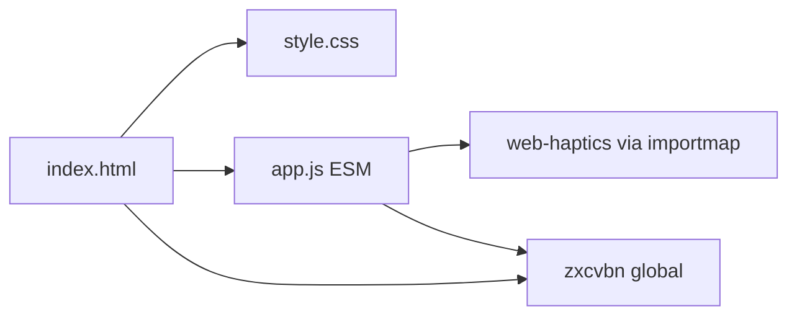

# Architecture

## Stack

- **Vanilla JS (ESM)** — no framework; the logic fits in ~200 lines, no abstraction needed
- **Tailwind CSS (Play CDN)** — utility classes; augmented by `style.css` for Apple HIG design tokens
- **zxcvbn** (CDN) — password strength estimation; loaded as a global before `app.js`
- **web-haptics** (esm.sh via importmap) — haptic feedback; silently no-ops on desktop
- **live-server** — dev only; not part of the production output

## Structure

- `index.html` — entry point; loads all scripts and styles; defines the DOM
- `app.js` — all logic (generate, strength update, copy, haptics, events) inside a single IIFE
- `style.css` — CSS custom properties (design tokens), component styles not expressible in Tailwind

## How it fits together

## Key decisions

- **No build step** — `importmap` resolves `web-haptics` from esm.sh; everything else is CDN or inline. Keeps deployment to a `git push`.
- **IIFE in app.js** — scopes all variables without a bundler; `"use strict"` is explicit.
- **zxcvbn as a global** — loaded via `<script>` before `app.js`; accessed as `window.zxcvbn`. Not imported as ESM to avoid a fetch-chain on first load.

## Gotchas

- `zxcvbn` is a global, not an ESM import — do not try to `import` it in `app.js`.
- Tailwind Play CDN is not for production at scale; fine here since this is a static personal tool.
- `crypto.getRandomValues` is sync; the modulo bias is negligible for character-set sizes used here.
