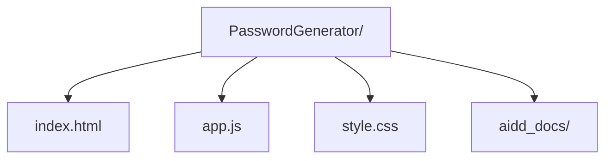

# Codebase Map

## Areas

- `/` (root): all source files — `index.html`, `app.js`, `style.css`
- `aidd_docs/`: project documentation and memory bank

## Entry points

- `index.html` — the app; open directly in a browser or via `npm start`
